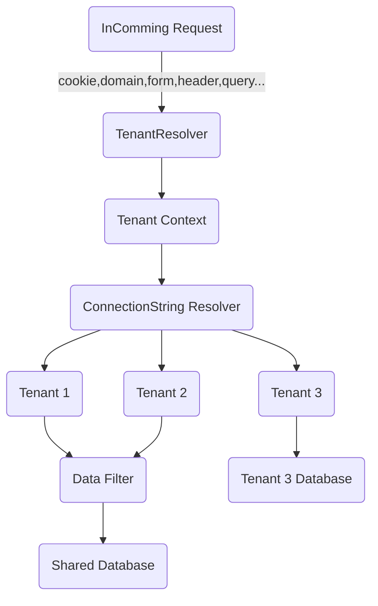

# go-saas
go framework for saas(multi-tenancy). `go-saas` targets to provide saas solution for go


# Overview

Install

```
go get github.com/goxiaoy/go-saas
```

* Different database architecture
  * [x] Single-tenancy:  Each database stores data from only one tenant.
  * [x] Multi-tenancy:  Each database stores data from multiple separate tenants (with mechanisms to protect data privacy).
  * [x] Hybrid tenancy models are also available.
* Support multiple web framework
    * [x] [gin](https://github.com/gin-gonic/gin)
    * [x] [mux](https://github.com/gorilla/mux)
    * [x] [kratos](https://github.com/go-kratos/kratos)
* Support multiple orms
    * [x] [gorm](https://github.com/go-gorm/gorm)
* Customizable tenant resolver
    * [x] Query String
    * [x] Form parameters
    * [x] Header
    * [x] Cookie
    * [x] Domain format
* Integration with gateway
  * [x] [apisix](https://github.com/apache/apisix)


 
    
# Sample Project
* [example](https://github.com/Goxiaoy/go-saas/tree/main/examples) combination of `go-saas`,`gin`,`gorm(sqlite)`
* [go-saas-kit](https://github.com/Goxiaoy/go-saas-kit) Microservice architecture starter kit for golang sass project

# Documentation
 Refer to [wiki](https://github.com/Goxiaoy/go-saas/wiki)


# References

https://docs.microsoft.com/en-us/azure/azure-sql/database/saas-tenancy-app-design-patterns
