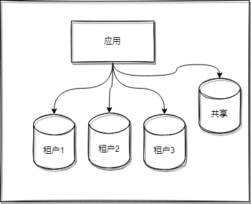
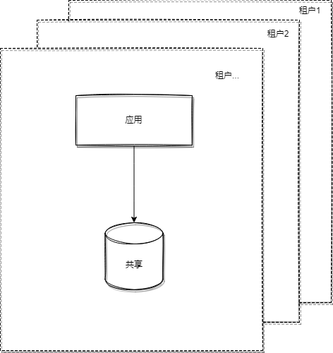
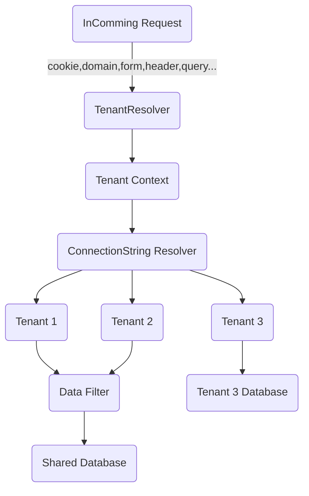

# go-saas

[English](./README.md) | [中文文档](./README_zh_Hans.md)

无头(无UI)的go语言的多租户框架。
本项目适合于简单的/单体(Web)项目，完整版本（支持微服务）可以看看[go-saas-kit](https://github.com/go-saas/kit)

# 概览
## 功能

* 不同的数据储存方式
  * [x] 每个租户各有数据库: 
  
    
  
  * [x] 各个租户共享数据库: （数据访问层提供隔离）
  
    
  
  * [x] 混合模式
  
  * [x] 实现自己的Resolver来自定义，比如说像分片啥的

* 支持多种Web框架
  * [x] [gin](https://github.com/gin-gonic/gin)
  * [x] net/http
  * [x] [kratos](https://github.com/go-kratos/kratos)
* 共享数据库下，支持自动数据隔离的Orm, 包括Orm所支持的数据库
  * [x] [gorm](https://github.com/go-gorm/gorm)
* 自定义租户解析
  * [x] Query String
  * [x] Form parameters
  * [x] Header
  * [x] Cookie
  * [x] Domain format
* 初始化和数据库迁移
  * [x] 租户创建后初始化/迁移 数据库，或者以后升级到新的版本
* 和网关集成
  * [x] [apisix](https://github.com/apache/apisix)


## 安装

```
go get github.com/go-saas/saas
```

## 设计



# 示例
* [example](https://github.com/go-saas/saas/tree/main/examples) 使用 `go-saas`,`gin`,`gorm(sqlite/mysql)`
* [go-saas-kit](https://github.com/go-saas/kit) golang多租户微服务解决方案

# 文档
 [wiki](https://github.com/go-saas/saas/wiki)


# 参考

https://docs.microsoft.com/zh-cn/azure/azure-sql/database/saas-tenancy-app-design-patterns
